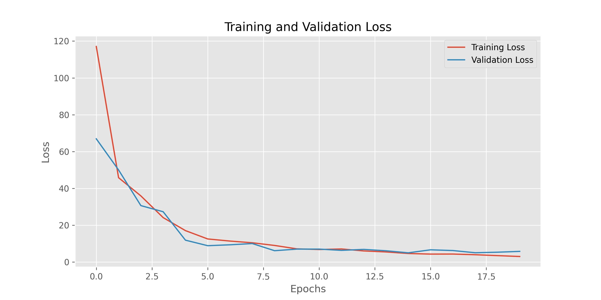

# Training and Evaluating a Keypoint Detection Model using ResNet50

## Data:
The data is sourced from this [repository](https://github.com/yastrebksv/TennisCourtDetector)

## Model Architecture
The model used is ResNet50, a deep residual network architecture. The last fully connected layer is modified to output 28 (14x2) keypoints, as required for this task.

## Training

**Loss Function**: Mean Squared Error (MSE) loss is used to measure the difference between predicted and true keypoints.
Optimizer: Adam optimizer.

## Evaluation

**Test Loss**: The average loss on the test set is calculated to evaluate model performance.
**Mean Squared Error (MSE)**: Measures the average squared difference between predicted and true keypoints.

## Tags
- Machine Learning
- Deep Learning
- Computer Vision
- Keypoint Detection
- ResNet50
- PyTorch
- Mean Squared Error
